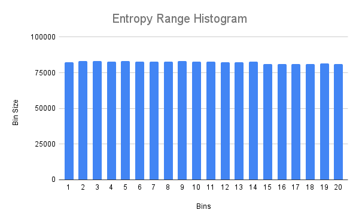
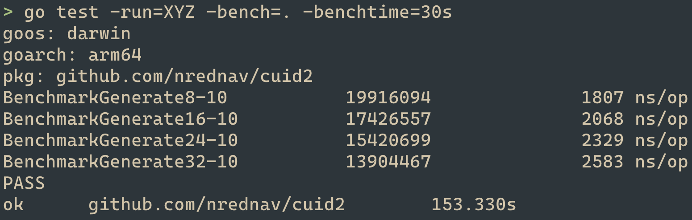

# Cuid2

> Secure, collision-resistant ids optimized for horizontal scaling and performance. Next generation UUIDs.

This is a port of the JavaScript library [@paralleldrive/cuid2](https://github.com/paralleldrive/cuid2), rewritten in Go.

For more information about Cuid2, including details about why and how, please refer to the [original documentation](https://github.com/paralleldrive/cuid2).

## Getting Started

With [Go module](https://github.com/golang/go/wiki/Modules) support, you can add the following import statement to your code:

```go
import "github.com/nrednav/cuid2"
```

and then run the following in the root of the repository to fetch the module:

```bash
go mod tidy
```

Alternatively, you can run the following command:

```bash
go get -u github.com/nrednav/cuid2
```

## Usage

```go
package main

import (
    "fmt"
    "github.com/nrednav/cuid2"
)

func main() {
    // Generate a Cuid with default, secure configuration
    id := cuid2.Generate()

    // or alternatively, provide your own configuration
    generate, err := cuid2.Init(
        cuid2.WithLength(32),
    )

    if err != nil {
        fmt.Println(err.Error())
    }

    // This function generates an id with a length of 32
    id = generate()

    // Validate
    cuid2.IsCuid(id)
}
```

## Configuration

You can configure the behavior of the Cuid2 generator by providing the `Init()`
function a series of option functions.

```go
package main

import (
    "github.com/nrednav/cuid2"
    "sync/atomic"
)

// (Optional) create your own custom counter
type Counter struct {
    value int64
}

func NewCounter(initialCount int64) *Counter {
    return &Counter{value: initialCount}
}

func (c *Counter) Increment() int64 {
    return atomic.AddInt64(&sc.value, 1)
}

func main() {
    generate, err := cuid2.Init(
        // Adjust the length of generated id, min = 2, max = 32
        cuid2.WithLength(32),

        // Provide a custom fingerprint that will be used by the id generator to help prevent
        // collisions when generating id's in a distributed system.
        cuid2.WithFingerprint("hello world"),

        // Provide a custom session counter that will be used to affect the
        // entropy of successive id generation calls
        cuid2.WithSessionCounter(NewCounter(0)),

        // Provide a custom function that generates a floating-point value between 0 and 1
        // This is useful for providing a deterministic source during testing
        cuid2.WithRandomFunc(func() float64 { return 0.1234 })
    )
}
```

## Testing

Run the tests with:

```bash
go test
```

This project also includes a long-running collision and distribution stress
test.

This test is excluded by default. To run the stress test, use the `integration`
build tag:

```bash
go test -tags=integration -v -timeout=0
```

Here's a sample distribution for one pool of generated ids:



## Benchmarks

The id generation function can be benchmarked for varying id lengths.

To run a benchmark, use:

```bash
go test -run=XYZ -bench=. -benchtime=30s
```

Results:


